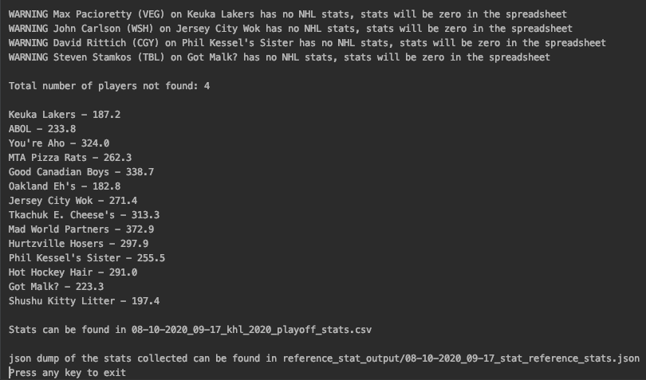

# khl-playoffs

A way to convert NHL player stats to fantasy hockey stats as a fill in for the 2020 NHL playoffs.

This queries the public NHL API that is documented in [this gitlab project here](https://gitlab.com/dword4/nhlapi/-/blob/master/stats-api.md#people).

This program currently gets stats for the 2019-2020 playoffs and prints out a CSV of the players from those specified in the `khl_roster.csv` file.

## Setup
Fill out the `khl_roster.csv` with the rosters of your fantasy teams making sure to include the player name, nhl and khl team in each row. Ideally these should be grouped by fantasy team as the outputted CSV matched the order in the roster csv.

You will need the `requests` module installed on your computer as well as [Python3](https://python.org). Install the requests module by running `python -m pip install requests` in your cmd/terminal.

#### Note

They python program expects the csv to be in utf-8. So if you have any weirdness, try opening the csv you save from the text editor in Excel and manually saving it as a utf-8 encoded csv.

## Running

Run the `generate_khl_stats.py` program to generate the csv. Output csv will follow `%m-%d-%Y_%H-%M_khl_2020_playoff_stats.csv` naming convention, copies of the stats used for reference will be placed in the `reference_stat_output` folder.

### Legacy

There is a legacy program under `csv-converter` that will use stats CSVs rather than querying the nhl api.

