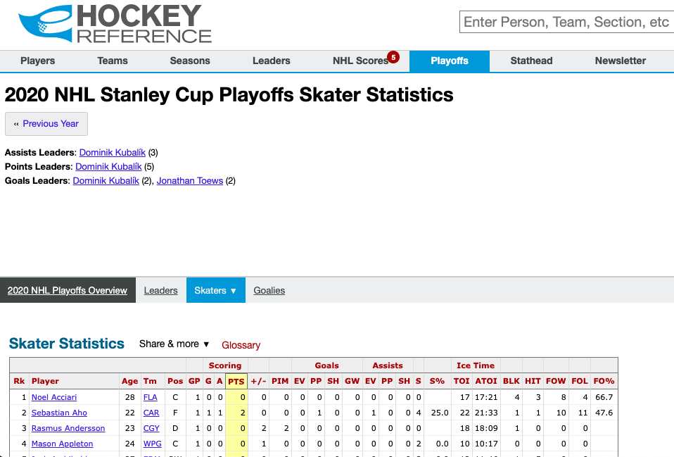
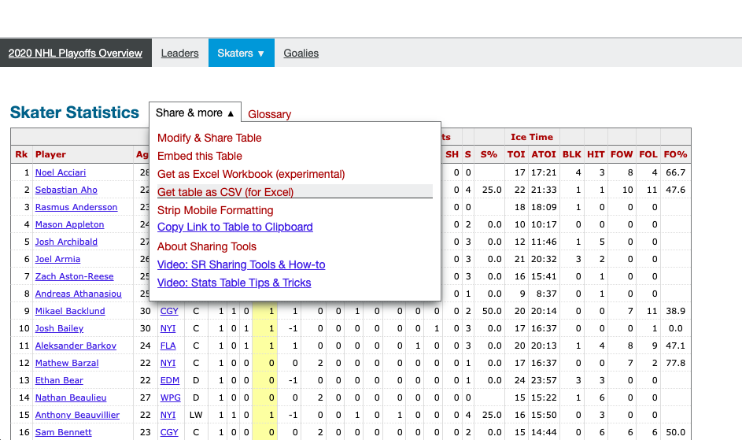
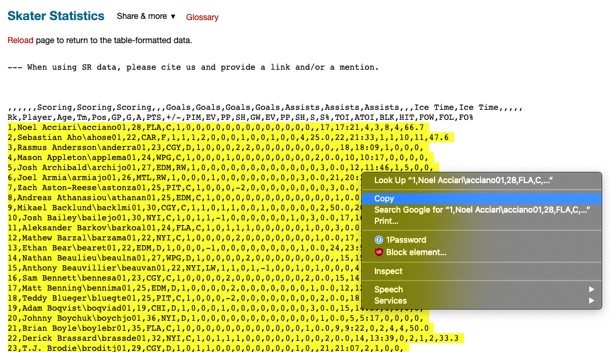
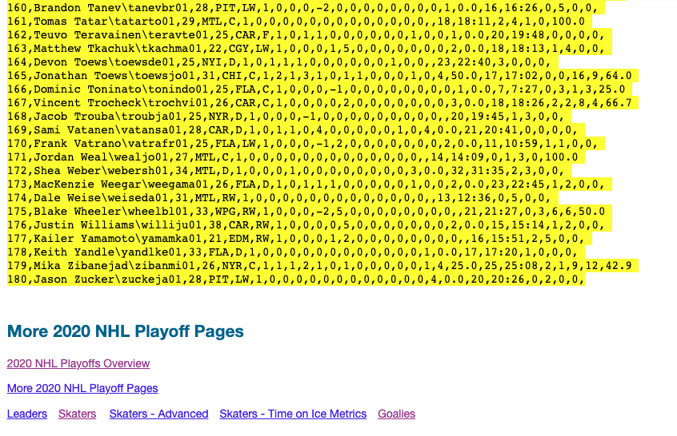
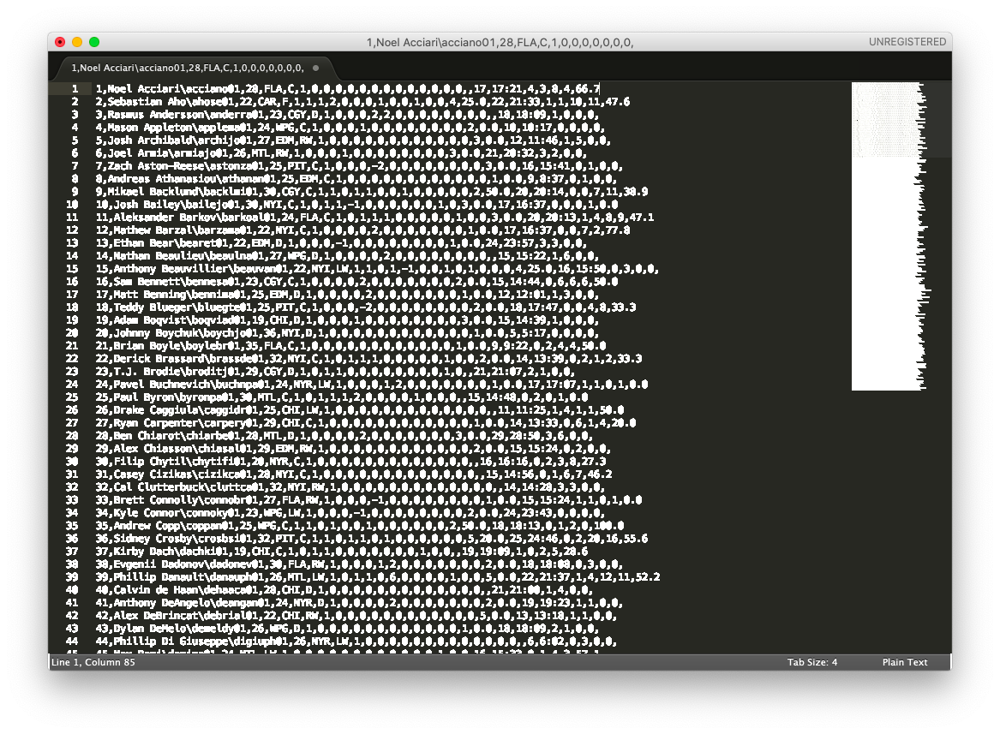
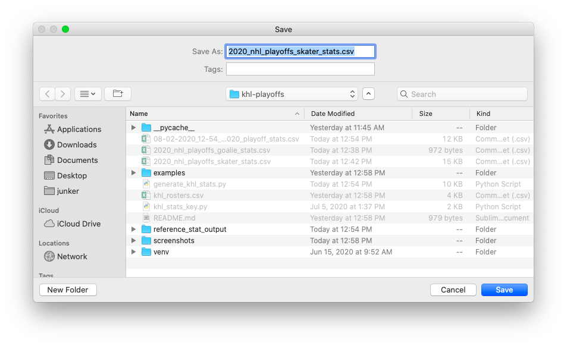
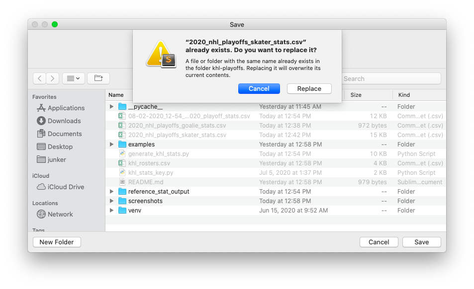

# khl-playoffs

A way to convert NHL player stats to fantasy hockey stats as a fill in for the 2020 NHL playoffs. This requires CSVs of player stats, and a roster CSV for each team. Examples from the 2019-2020 season are currently in this repository.

## Setup
You will need to ensure that the csv names specified in the top of `csv-converter.py` are all in the same root directory. You need to set the following variables:
* khl_roster_csv
* skater_stats_csv
* goalie_stats_csv

### Updating Stats CSVs

Examples of all CSVs included under `examples/`. Order is extremely important for the CSVS, it expects the headers and specific order found in the examples.

An example output in the same folder, called `khl_2020_playoff_DUMMY_stats.csv`

#### Download new sheets

1. You will need to download both the skater and the goalie stats from the below links:
* _Skater data source:_ https://www.hockey-reference.com/playoffs/NHL_2020_skaters.html
* _Goalie data source:_ https://www.hockey-reference.com/playoffs/NHL_2020_goalies.html

2. Go to the basic stats page for the desired position, and at the top of the table select `Share & More` and `Get table as CSV`

3. Select all of the data starting from the number 1 rank (skipping the first two lines with the column headers) all the way to the bottom of the list of players.

4. Paste the data into a text editor (Notepad, Sublime, Text/Edit, Notepad++, etc.) and save it to the `khl-playoffs` folder, replacing the existing `2020_nhl_playoffs_skater_stats.csv` or `2020_nhl_playoffs_goalie_stats.csv`

#### Note

They python program expects the csv to be in utf-8. So if you have any weirdness, try opening the csv you save from the text editor in Excel and manually saving it as a utf-8 encoded csv.

## Running

Run the `generate_khl_stats.py` program to generate the csv. Output csv will follow `%m-%d-%Y_%H-%M_khl_2020_playoff_stats.csv` naming convention, copies of the stats used for reference will be placed in the `reference_stat_output` folder.

